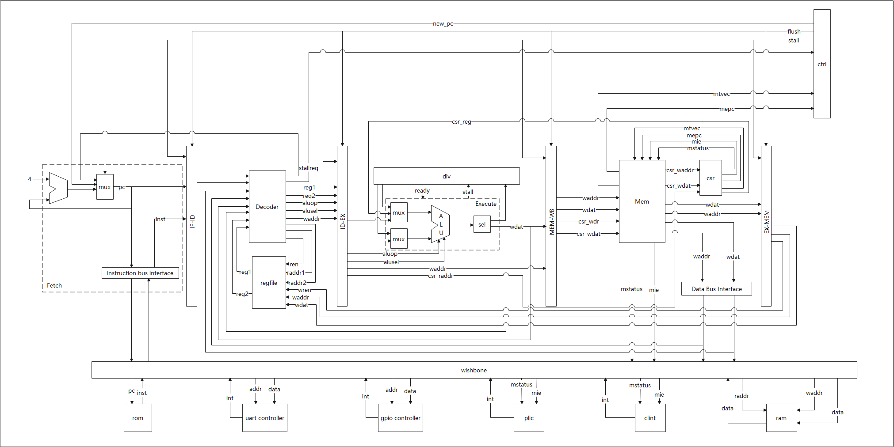
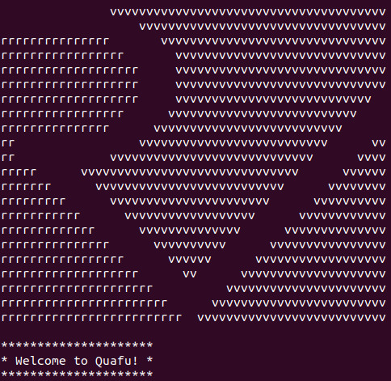

[](https://github.com/gzzyyxh/Quafu/blob/main/LICENSE) [](https://linux.org/) [](https://www.microsoft.com/zh-cn/windows/)

# Quafu

Quafu is a small soc which has a certain number of peripherals mounted on the [wishbone bus](https://opencores.org/projects/wb_conmax), and its core is a 32-bit pipeline and sequential processor written in verilog(for running [RVOS](https://github.com/plctlab/riscv-operating-system-mooc)).

## Overview



*The above figure does not show all the details. Click [here](https://github.com/gzzyyxh/Falco/raw/main/img/architecture.png) to See more clearly*

## Implemented ISAs

* RV32I

* Zicsr extension

* M extension

* Machine-level ISA

* ...

## Features

* 32-bit.

* A load/store architecture.

* A pipelined architecture.

* Two modes(M & U).

* Support exception & interrupt

* Address space(wishbone B2):

                                |----0xffff_ffff----|
                                |                   |
                                |                   |
                                |                   |
                                |                   |
                                |                   |
                                |      unused       |
                                |                   |
                                |                   |
                                |                   |
                                |                   |
                                |                   |
                                |                   |
                                |-------------------| <--- 0x6000_0000
                                |        ram        |
                                |-------------------| <--- 0x5000_0000
                                |       clint       |
                                |-------------------| <--- 0x4000_0000
                                |        plic       |
                                |-------------------| <--- 0x3000_0000
                                |        gpio       |
                                |-------------------| <--- 0x2000_0000
                                |        uart       |
                                |-------------------| <--- 0x1000_0000
                                |        rom        |
                                |-------------------| <--- 0x0000_0000

* ...

### Some extra features are planned for the future or under development

* branch predictor

* sdram controller

* flash controller

* spi controller

* supervisor modes

* RV32A support

* debug support(JTAG)

* Replace with AXI4

* MMU(Sv32 paging, for running [xv6-riscv](https://github.com/mit-pdos/xv6-riscv) or others)

* ...

    Due to lack of time, I will continue to fix existing *bugs* and complete the above plans after the end of this semester (July and August 2022).

## Geting Started

```
$sudo apt update

$sudo apt install build-essential gcc make perl dkms git gcc-riscv64-unknown-elf

$git clone https://github.com/gzzyyxh/Quafu
```

Synthesis via [Quartus Prime](https://www.intel.cn/content/www/cn/zh/software/programmable/quartus-prime/download.html)

```$cd cpu```

You can also try compiling with open source tools such as ```iverilog``` and ```verilator```, or other EDA software such as [vivado](https://china.xilinx.com/support/download.html).

### Notice

* Your FPGA board must meet the following conditions:

  * logic elements >= 10,877

  * registers >= 4,155

The actual resource usage depends on EDA, and the above data is for reference only

* ROM and RAM are implemented using Altera IP core. You should pay attention to this.

```$cd os```

Compile [RVOS](https://github.com/plctlab/riscv-operating-system-mooc)

```$make```

Connecting serial port equipment

```
$sudo apt-get install minicom

$sudo minicom -s
```

Select ```serial port steup``` and configure serial device as the corresponding board, ```Bps/Par/Bits``` is ```115200 8N1```.

```$sudo minicom```

Then you will see



## Refrences

* [RISC-V Specification Volume 1, Unprivileged Spec v.](https://github.com/riscv/riscv-isa-manual/releases/download/Ratified-IMAFDQC/riscv-spec-20191213.pdf)

* [RISC-V Specification Volume 2, Privileged Spec v.](https://github.com/riscv/riscv-isa-manual/releases/download/Priv-v1.12/riscv-privileged-20211203.pdf)

* [RISC-V-Reader-Chinese-v2p1](http://riscvbook.com/chinese/RISC-V-Reader-Chinese-v2p1.pdf)

* [RVOS](https://github.com/plctlab/riscv-operating-system-mooc)

* [xv6-riscv](https://github.com/mit-pdos/xv6-riscv)

* [Computer Organization and Design RISC-V Edition](https://book.douban.com/subject/27103952/)

## Sources

* [emulsiV](https://guillaume-savaton-eseo.github.io/emulsiV/)

* [wishbone IP core](https://opencores.org/projects/wb_conmax)

* [UART IP core](https://opencores.org/projects/uart6551)
